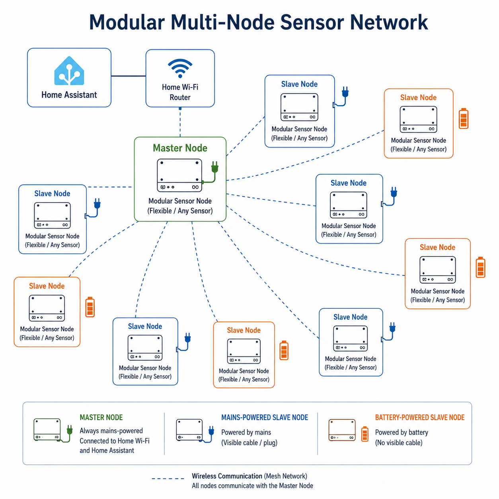
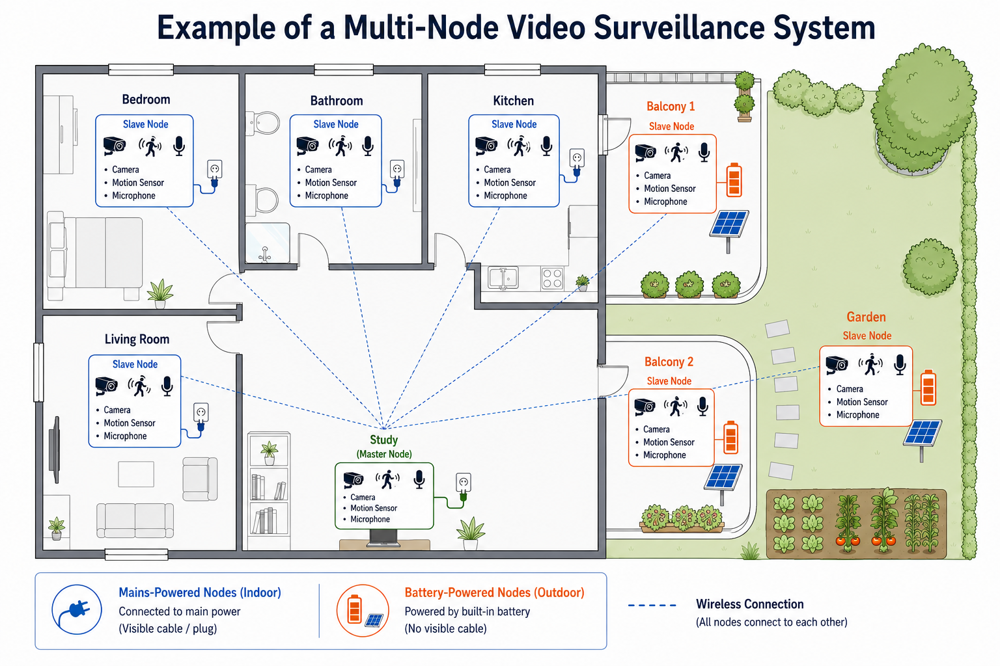
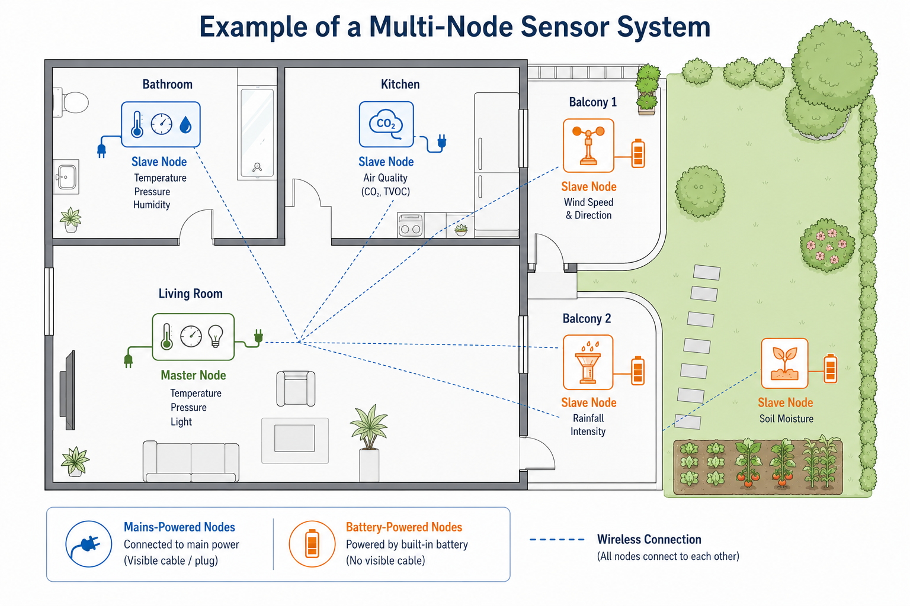

# ESP32 Hybrid Sensor Network

🇬🇧 [English version](README.md)

> **Questo repository è attualmente in :** [Fase 1](docs/progress/phase-1/)  
> **Data del documento:** 8 giugno 2026

Questo repository racconta un progetto personale in fase di sviluppo, nato per fare pratica in modo concreto con ESP32, comunicazione tra nodi, interfacce locali e logiche di failover.

L'idea di base è costruire una rete IoT modulare composta da un solo nodo Master e più nodi Slave, con comunicazione via ESP-NOW, elezione automatica del Master in caso di guasto, supporto ad alimentazione a batteria o a corrente e possibilità di montare sensori diversi a seconda dell'applicazione.

Non è un progetto presentato come prodotto finito o soluzione professionale definitiva. È, prima di tutto, un percorso pratico di studio, test e crescita tecnica.

## Perché questo progetto

Da tempo seguo il mondo dell'IoT, ma con questo progetto ho voluto affrontarlo in modo più pratico, passando dalla curiosità e dallo studio alla sperimentazione diretta.

L'obiettivo non è costruire soltanto un nodo sensore, ma una piccola infrastruttura distribuita che permetta di capire meglio problemi reali come:

- coordinamento tra nodi;
- continuità del servizio in caso di guasto;
- limiti della comunicazione radio in ambienti reali;
- gestione locale tramite interfaccia web;
- differenze tra nodi alimentati a corrente e nodi alimentati a batteria.

In questa fase il progetto viene testato su **ESP32-C3 SuperMini** e, per le prove iniziali, con sensori ambientali come il BMP280. L'idea però è mantenere la struttura abbastanza flessibile da poterla riutilizzare con sensori diversi e quindi in contesti applicativi anche molto differenti.

## Stato del progetto

Il progetto è **work in progress**.

La struttura generale è già definita e il codice attuale implementa diversi aspetti importanti: gestione dei ruoli, nodo Master unico, elezione automatica, interfaccia web locale, parametri persistenti, log di stato e integrazione con i sensori.

Allo stesso tempo, ci sono ancora parti in evoluzione. In particolare, i test pratici mi stanno aiutando a capire meglio dove l'architettura attuale funziona bene e dove invece ha bisogno di essere ripensata.

## Architettura attuale

Al momento il sistema ruota attorno a due ruoli principali:

- **Nodo Master**: è l'unico nodo che gestisce il coordinamento locale, ospita il Web Server, espone la GUI di controllo e, quando disponibile, si collega alla rete Wi-Fi.
- **Nodi Slave**: inviano stato, letture sensore e ricevono comandi tramite ESP-NOW.

È presente anche una logica di elezione. Se il Master non è più raggiungibile, gli altri nodi possono avviare un'elezione e promuovere automaticamente un nuovo Master in base alla priorità e allo stato del nodo.

Questo approccio mi permette di ridurre il carico sul Wi-Fi domestico, perché l'interfaccia locale è concentrata su un solo nodo, mentre gli altri comunicano via radio.

## Struttura e Scenari di Utilizzo

Per chiarire la flessibilità del progetto, ho preparato alcuni schemi che mostrano la topologia di rete e solo due esempi tra i molti scenari applicativi possibili.

### 1. Struttura modulare della rete
L'architettura generica si basa su un Master connesso alla rete Wi-Fi/Home Assistant e su una serie di nodi Slave flessibili. I nodi possono essere alimentati a corrente oppure a batteria, a seconda del ruolo e dello scenario d'uso.

### 2. Scenario A: Videosorveglianza multi-nodo
Il primo esempio di utilizzo sfrutta la rete per un sistema di monitoraggio. In questo scenario, i nodi sono equipaggiati con videocamera, sensore di movimento/presenza e microfono. I nodi esterni (su balconi e giardino) operano a batteria, eventualmente supportati da piccoli pannelli solari.

### 3. Scenario B: Sensori ambientali diffusi
Il secondo esempio mostra un'applicazione per il monitoraggio climatico e ambientale. All'interno si misurano temperatura, pressione, umidità, luminosità e qualità dell'aria (CO2, TVOC). All'esterno, i nodi a batteria monitorano parametri meteorologici e agricoli, come la velocità e direzione del vento, l'intensità della pioggia sul balcone e l'umidità del terreno nell'orto.

## Cosa c'è già nel codice

In questa fase il progetto include già:

- un solo Master attivo alla volta;
- gestione dei ruoli Master, Slave e Candidate;
- elezione automatica in caso di failover;
- Web GUI locale per monitoraggio e configurazione;
- gestione di parametri persistenti;
- supporto a profili di alimentazione diversi;
- raccolta di dati sensore;
- log per nodo e tracciamento dello stato;
- supporto a display locale.

Questa parte per me è importante, perché rappresenta la base su cui sto cercando di costruire qualcosa di più robusto senza perdere semplicità.

## Cosa sto imparando dai test

Uno degli aspetti più interessanti del progetto è che mi sta costringendo a confrontarmi con il comportamento reale della rete, non solo con quello teorico.

Nei test che sto facendo, mi sono accorto che in alcune condizioni pratiche — ad esempio distanza tra i nodi, muri, disposizione fisica dell'hardware o ambiente circostante — mantenere una visione unica e stabile della rete può diventare più complicato di quanto sembri all'inizio.

Nei test che sto facendo, ho osservato che, allo stato attuale, se alcuni nodi perdono visibilità del Master, possono interpretare la situazione come un guasto e avviare una nuova elezione. Quando succede, la rete rischia di dividersi in sottoreti separate, ciascuna con un proprio riferimento locale. È uno degli aspetti su cui sto lavorando di più, perché mi sta mostrando in modo molto concreto dove l’architettura attuale ha bisogno di evolversi.

## Evoluzione prevista

Proprio da queste osservazioni nasce il passo successivo del progetto.

L'idea su cui sto lavorando è evolvere verso un'architettura più ibrida: mantenere ESP-NOW, soprattutto per nodi più leggeri o alimentati a batteria, e affiancare una struttura di comunicazione più robusta per i nodi alimentati a corrente.

La direzione è quella di introdurre una dorsale di tipo mesh tra i nodi powered, così da migliorare copertura, continuità e capacità di instradare i messaggi in scenari più complessi.

Questa parte non è ancora il cuore dell'implementazione attuale, ed è giusto dirlo chiaramente. In questo momento rappresenta la fase successiva del progetto: quella in cui sto cercando di trasformare un sistema funzionante in laboratorio in qualcosa di più solido anche in condizioni meno ideali.

## Approccio allo sviluppo

Questo progetto, compresa la documentazione, è stato sviluppato con il supporto di strumenti di AI.

L'uso dell'AI non sostituisce la parte pratica: test, prove, scelta della direzione architetturale, individuazione dei problemi, modifica dei requisiti e valutazione di ciò che funziona oppure no dipendono dall'esperienza diretta fatta sul progetto. L'AI è per me uno strumento di supporto nello sviluppo, nel refactoring e nella documentazione, non un sostituto della sperimentazione.

## Fasi di sviluppo

### Fase 1 - Prime basi

- Studio della struttura generale dei nodi.
- Definizione di un Master unico.
- Comunicazione iniziale tra nodi via ESP-NOW.
- Prime prove con sensori e dati di stato.

### Fase 2 - Controllo locale

- Introduzione del Web Server sul Master.
- Dashboard locale per monitoraggio e controllo.
- Configurazione dei nodi da interfaccia web.
- Gestione di label, priorità, profili e comandi operativi.

### Fase 3 - Continuità del sistema

- Logica di elezione automatica.
- Gestione del failover.
- Cambio di ruolo in caso di assenza del Master.
- Persistenza delle preferenze e recupero dopo riavvio.

### Fase 4 - Verifica sul campo

- Test in ambienti meno ideali rispetto al banco di lavoro.
- Osservazione dei limiti pratici della copertura radio.
- Comprensione del rischio di frammentazione della rete.
- Necessità di ripensare il modello di comunicazione.

### Fase 5 - Evoluzione architetturale

- Mantenere nodi leggeri via ESP-NOW.
- Introdurre nodi alimentati a corrente con funzione di backbone.
- Migliorare robustezza, copertura e instradamento.
- Arrivare a una rete distribuita più affidabile.

## Perché lo sto documentando così

In questa fase mi interessa che il repository spieghi bene il progetto anche senza mostrare subito tutto come se fosse una soluzione già definitiva.

Vorrei che chi legge capisse:

- cosa il sistema fa già oggi;
- quali problemi pratici sono emersi;
- in che direzione sto cercando di farlo evolvere;
- quanto questo percorso sia per me anche un modo per crescere sul piano tecnico.

Per questo il repository, almeno inizialmente, è pensato per contenere soprattutto documentazione, schemi, immagini, note di sviluppo e aggiornamenti sulle varie fasi del lavoro.

## Cosa può contenere questo repository

Per rendere il progetto più chiaro e leggibile, i contenuti più utili in questa fase sono:

- descrizione dell'architettura;
- diagrammi dei ruoli dei nodi;
- foto dell'hardware reale;
- screenshot della GUI locale;
- roadmap del progetto;
- pubblicazione progressiva del codice.

## Stato attuale del progetto

- **Fatto:** definizione dell’architettura single-master, gestione dei ruoli Master e Slave, comunicazione ESP-NOW tra i nodi, GUI web locale, elezione automatica del Master, integrazione dei sensori e gestione dei parametri persistenti.
- **In corso:** test sul campo, valutazione della stabilità della rete in ambienti reali e rifinitura dell’architettura ibrida.
- **Prossimo passo:** evoluzione verso una rete più robusta e scalabile, ampliamento degli scenari di integrazione e ulteriore sviluppo hardware.

## Roadmap

- [x] Definizione dell’architettura single-master.
- [x] Comunicazione base tra nodi tramite ESP-NOW.
- [x] Implementazione della GUI locale e del Web Server.
- [x] Gestione automatica dell’elezione del Master.
- [x] Integrazione dei sensori e dei parametri persistenti.
- [ ] Aggiungere il rilevamento della luminosità ambientale e il controllo del display basato sulla prossimità.
- [ ] Migliorare la rete con un’architettura ibrida **ESP-MESH + ESP-NOW**.
- [ ] Integrare il sistema con un **assistente vocale**.
- [ ] Progettare e realizzare **contenitori stampati in 3D** per i nodi sensore.
- [ ] Testare la piattaforma con altri tipi di sensori, inclusi scenari di **videosorveglianza**.
- [ ] Aggiungere **pannelli solari** dove possibile per i nodi alimentati a batteria.
- [ ] Pubblicare una versione più stabile e completa.

## Nota finale

Questo progetto non nasce per presentare una soluzione perfetta, ma per costruire esperienza pratica su problemi reali di IoT ed embedded networking.

Proprio per questo mi interessa documentarlo in modo onesto: non solo mostrando ciò che già funziona, ma anche ciò che sto ancora cercando di capire e migliorare.

## Crediti

Questo progetto è stato sviluppato da Ignazio Aita (https://github.com/igzat81/).
